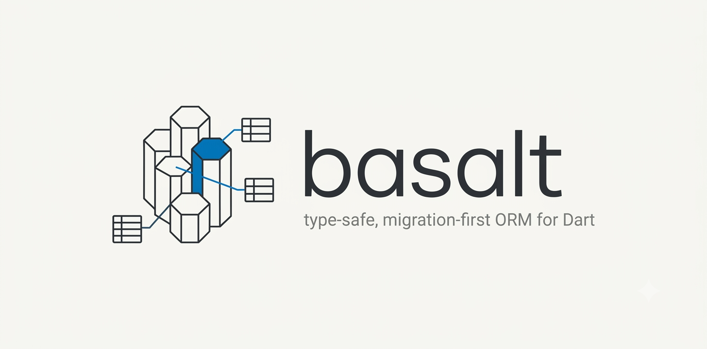

<p align="center">
  
</p>


**A type-safe, migration-first ORM for Dart — a compile-time-checked query builder, a
CLI, code-generated row mappers, and a DevTools inspector.**

- 🛡️ **Type-safe query builder** — columns and predicates carry a phantom table type, so mixing tables in one `WHERE` is a *compile error*, not a runtime surprise.
- 🔌 **Pluggable backends** — one `Connection` interface; **SQLite** and **Postgres** run the *same* DSL, schema, and migrations unchanged.
- 🧬 **Codegen derives** — `@Queryable` / `@Insertable` / `@AsChangeset` / `@Relation` generate readers, `INSERT`/`UPDATE` builders, and self-mapping join queries via `build_runner`.
- 🚚 **CLI** — `basalt migration generate/run/revert/redo`, `database reset`, `generate-schema`; migrations are tracked in `__basalt_schema_migrations`.
- 🔎 **DevTools inspector** — a "basalt" tab to browse, filter, sort, and edit tables and run raw SQL against a live connection.
- 🧩 **Build-vs-execute separation** — the query builder is a pure AST → `(sql, params)` transform, so serialization is trivially unit-testable and new backends are drop-in.

```dart
import 'package:basalt/basalt.dart';
import 'package:basalt_sqlite/basalt_sqlite.dart';

import 'schema.dart'; // generated by `basalt generate-schema`
import 'models.dart'; // your User (read) / NewUser (insert) classes + generated mappers

Future<void> main() async {
  final db = SqliteConnection.open('app.db');

  // Write — toInsert() is generated from @Insertable on NewUser.
  await db.execute(const NewUser(1, 'Bob', 30).toInsert());

  // Read — mixing another table into this WHERE would not compile.
  final adults = await db.fetch(
    from(Users.table)
        .where((Users.age > 18) & Users.name.like('A%'))
        .orderBy(Users.name.asc())
        .map(userMapper.read),
  );
  print(adults);

  await db.close();
}
```

> **Status: early / experimental.** APIs may change; not yet published to pub.dev. Inspired by basalt —
> not affiliated and not a 1:1 port. SQLite and Postgres run the same DSL, schema, and migrations.

---

## Table of contents

- [Why basalt_dart](#why-basalt_dart)
- [Packages](#packages)
- [Install](#install)
- [Getting started](#getting-started)
- [The query DSL](#the-query-dsl)
- [Codegen (derives)](#codegen-derives)
- [Migrations CLI](#migrations-cli)
- [Backends](#backends)
- [DevTools inspector](#devtools-inspector)
- [basalt alignment](#basalt-alignment)
- [Documentation](#documentation)
- [Contributing](#contributing)
- [License](#license)

## Why basalt_dart

Most Dart data-access options make you choose between *ergonomics* and *safety*. basalt_dart follows
basalt's answer: your **database schema is the source of truth**, a typed schema is generated from it,
and every query is checked against that schema at compile time.

- **The schema is generated, then trusted.** You write SQL migrations, apply them, and run `generate-schema`
  to emit a typed `schema.dart`. Columns become `static const` objects (`Users.age` is a
  `ValueColumn<int, Users>`) reused by both the query builder and the codegen annotations.
- **Queries can't reference the wrong table.** `Expression<T, Tbl>` carries a phantom `Tbl` scope, so
  `from(Users.table).where(Posts.title.eq('x'))` is a compile error. After a join the scope relaxes and the
  serializer validates every referenced table is in the `FROM`/`JOIN` clause.
- **Build vs execute.** `QueryBuilder` + `SqlDialect` turn a typed AST into `(String sql, List<Object?>
  params)` with *zero* driver dependency; a `Connection` runs it. That is what keeps serialization
  unit-testable and makes SQLite and Postgres behave identically.

## Packages

This repo is a Dart **pub workspace** (monorepo). Dart SDK: `>=3.5.0 <4.0.0`.

| Package | Role |
|---|---|
| [`basalt`](packages/basalt) | Dialect-agnostic **core**: types, schema, expressions, query/write builders, serializer, `Connection`/`SqlDialect`, annotations. Also ships the **DevTools inspector** (`package:basalt/devtools.dart`). |
| [`basalt_sqlite`](packages/basalt_sqlite) | **SQLite** backend — `SqliteConnection` + `SqliteDialect` (on [`sqlite3`](https://pub.dev/packages/sqlite3)). |
| [`basalt_postgres`](packages/basalt_postgres) | **Postgres** backend — `PostgresConnection` + `PostgresDialect` (on [`postgres`](https://pub.dev/packages/postgres)). |
| [`basalt_cli`](packages/basalt_cli) | The **`basalt`** executable: migrations + `generate-schema`. |
| [`basalt_codegen`](packages/basalt_codegen) | **`build_runner`** derives for the annotations. |
| [`basalt_mcp`](packages/basalt_mcp) | **`basalt_mcp`** MCP server: live DB inspection in a running debug app via VM service. |
| [`basalt_devtools_extension`](packages/basalt_devtools_extension) | Flutter web UI for the DevTools "basalt" tab. |
| [`example/`](example) | End-to-end demo (migrations → schema → models → queries). |

## Install

Add the runtime packages to your app and the codegen derive to `dev_dependencies`:

```yaml
dependencies:
  basalt: ^0.0.1
  basalt_sqlite: ^0.0.1

dev_dependencies:
  basalt_codegen: ^0.0.1   # build_runner derives
  build_runner: ^2.4.0
```

Install the **`basalt` CLI globally** (migrations + `generate-schema`):

```sh
dart pub global activate basalt_cli
export PATH="$PATH":"$HOME/.pub-cache/bin"   # add to your shell profile
```

## Getting started

The recommended workflow: **(1) create a migration → (2) generate the typed schema → (3) write your own
query/insert/update data classes.**

Configure the CLI once (`basalt.yaml` in your project root):

```yaml
database_url: app.db
migrations_dir: migrations
```

### 1. Create a migration

Your **database schema is the source of truth** — you write SQL, not Dart models.

```sh
basalt migration generate create_users
```

Edit `migrations/<version>_create_users/up.sql` and `down.sql` to create the `users` table.

Example `up.sql`:

```sql
CREATE TABLE users (
  id         INTEGER NOT NULL PRIMARY KEY,
  name       TEXT    NOT NULL,
  age        INTEGER NOT NULL,
  active     INTEGER NOT NULL DEFAULT 1,
  manager_id INTEGER REFERENCES users(id)
);
```

Example `down.sql`:

```sql
DROP TABLE users;
```

Apply the migration:

```sh
basalt migration run
```

### 2. Generate the typed schema

```sh
basalt generate-schema
```

This emits `schema.dart` — do not edit by hand; trust it for compile-time-checked queries:

```dart
// GENERATED by `basalt generate-schema`. Do not edit by hand.
abstract final class Users {
  static const id = PrimaryKey<int, Users>('users', 'id', SqlType.integer);
  static const name = ValueColumn<String, Users>('users', 'name', SqlType.text);
  static const age = ValueColumn<int, Users>('users', 'age', SqlType.integer);
  static const active = ValueColumn<int, Users>('users', 'active', SqlType.integer);
  static const managerId = Ref<int?, Users, Users>('users', 'manager_id', SqlType.integerOrNull, references: Users.id);
  static const table = TableRef<Users>('users', [id, name, age, active, managerId]);
}
```

### 3. Write your own query/insert/update data classes

Write **separate** data classes over the generated schema — one per operation — so each class carries
exactly the fields that operation needs (e.g. insert without server-default columns, update with only
the fields you patch). `build_runner` emits the boilerplate into `<file>.g.dart`:

```dart
// READ — @Queryable: full row model, including relations.
@Queryable(Users.table)
class User {
  final int id;
  final String name;
  final int age;
  final int active;
  final int? managerId;

  @Relation(Users.managerId) // read-side self-join, nested & alias-safe
  final User? manager;

  const User(this.id, this.name, this.age, this.active, {this.managerId, this.manager});
}

// INSERT — @Insertable: fields you set when creating a row.
@Insertable(Users.table)
class NewUser {
  final int id;
  final String name;
  final int age;
  final int? managerId;
  const NewUser(this.id, this.name, this.age, {this.managerId});
}

// UPDATE — @AsChangeset: only the fields you change.
@AsChangeset(Users.table)
class UserPatch {
  final int age;
  final int active;
  const UserPatch(this.age, this.active);
}
```

```sh
dart run build_runner build
```

You get `userMapper` / `userQuery` (read — `userQuery` wires up the `manager` self-join for you),
`newUser.toInsert()` (insert), and `userPatch.toUpdate()` (update). Field names map to schema columns
by convention — no `@Column` overrides needed here.

> All three derives on one class are supported too (see [`example/lib/user.dart`](example/lib/user.dart));
> full derive reference: **[packages/basalt/doc/annotations.md](packages/basalt/doc/annotations.md)**.

The full walkthrough is in **[packages/basalt_cli/doc/getting_started.md](packages/basalt_cli/doc/getting_started.md)**.

## The query DSL

Everything below builds a typed `MappedQuery` you run with `db.fetch(...)` (or the basalt-style
`.load(db)` / `.first(db)` / `.optional(db)` terminals). Full reference:
**[packages/basalt/doc/queries.md](packages/basalt/doc/queries.md)** (also
[expressions](packages/basalt/doc/expressions.md),
[writes](packages/basalt/doc/writes.md)).

```dart
// Predicates: eq/ne/gt/ge/lt/le, isIn/eqAny, between, like, isNull/isNotNull,
// combined with & / | (chaining .where() REPLACES — use & or .filter()).
from(Users.table)
    .where(Users.age.between(26, 45) & Users.name.like('%a%'))
    .orderBy(Users.age.asc()).limit(20).offset(0)
    .map(userMapper.read);

// Joins: innerJoin / leftJoin, FK-driven (onFk:) or explicit (on:), self-joins via aliases.
final mgr = Users.table.aliased('mgr');
from(Users.table)
    .innerJoin(mgr, on: Users.managerId.eqColumn(mgr.col(Users.id)))
    .map((r) => '${r.get(Users.name)} -> ${r.get(mgr.col(Users.name))}');

// Aggregates & grouping: count/sum/avg/min/max, groupBy + having.
from(Posts.table)
    .groupBy([Posts.authorId])
    .having(Posts.views.sum().gt(100))
    .select([Posts.authorId, Posts.views.sum()])
    .map((r) => (r.get(Posts.authorId), r.get(Posts.views.sum())));

// Writes: insert / update / delete, plus RETURNING and upsert (ON CONFLICT).
insertInto(Users.table).value(Users.name.set('Bob'));
update(Users.table).set(Users.age.set(31)).where(Users.id.eq(1));
deleteFrom(Posts.table).where(Posts.views.lt(10));
```

## Codegen (derives)

Annotate a data class over your generated schema; `build_runner` emits the boilerplate into `<file>.g.dart`.
Same `User` / `NewUser` / `UserPatch` classes as [Getting started](#3-write-your-own-queryinsertupdate-data-classes)
above — `@Queryable` on `User` is what generates `$UserFromRow`, `userMapper`, and `userQuery`;
`@Relation(Users.managerId)` is what makes `userQuery` resolve the self-join. Full guide:
**[packages/basalt/doc/annotations.md](packages/basalt/doc/annotations.md)**.

| Annotation | Generates |
|---|---|
| `@Queryable(table)` | `$XFromRow` reader, `xMapper` (`RowMapper<X>`), `xQuery` getter, bare `findX(pk)` |
| `@Insertable(table)` | `extension XInsert on X { InsertStatement<T> toInsert() }` |
| `@AsChangeset(table)` | `extension XChangeset on X { UpdateStatement<T> toUpdate() }` |
| `@Column(col, {readOnly, writeOnly})` | field → column mapping + read/write direction |
| `@Relation(fk, {depth})` | nested related object via joins, unrolled `depth` levels with path aliases |

## Migrations CLI

Run from a directory with a `basalt.yaml` (or `DATABASE_URL` set). Details:
**[packages/basalt_cli/doc/migrations.md](packages/basalt_cli/doc/migrations.md)**.

| Command | Effect |
|---|---|
| `setup` | Create the migrations dir + database and apply pending migrations. |
| `migration generate <name>` | Scaffold `migrations/<version>_<name>/{up,down}.sql`. |
| `migration run` / `revert` / `redo` | Apply pending / roll back latest / revert+re-apply. |
| `migration list` | Show applied vs pending. |
| `database reset` | Recreate the database from scratch. |
| `generate-schema` | Introspect the DB into a typed Dart schema (`schema_output` in `basalt.yaml`). |

Applied versions are tracked in `__basalt_schema_migrations` (matching the basalt CLI), so on SQLite
you can **share a migrations directory and database with the basalt CLI**.

## Backends

The DSL, schema, migrations, and codegen are backend-agnostic; pick a `Connection`:

```dart
final sqlite = SqliteConnection.open('app.db');          // or .memory()
final pg = await PostgresConnection.open(
    host: 'localhost', port: 5432, database: 'app',
    username: 'postgres', password: 'postgres', ssl: false);
```

The CLI selects the backend by URL scheme (`postgres://…` vs a SQLite path). Cross-backend value codecs
mean `int`/`text`/`real`/`bool`/`DateTime` columns behave the same on both. See
[`basalt_sqlite`](packages/basalt_sqlite) and [`basalt_postgres`](packages/basalt_postgres).

## DevTools inspector

`package:basalt/devtools.dart` powers a DevTools **"basalt"** tab: pick the active instance, browse / filter
/ sort tables, view and edit rows, and run raw SQL — for SQLite *and* Postgres.

```dart
import 'package:basalt/devtools.dart';
BasaltDevTools.register(conn, name: 'main'); // dev-only; absent from release builds
```

Opening the tab needs a Dart Tooling Daemon, so use the launcher:
`dart run example/tool/inspect.dart`, then enable **basalt** in DevTools' Extensions menu. See
[`packages/basalt/README.md`](packages/basalt/README.md#devtools-inspector).

For AI agents (Cursor, Claude Code, etc.), use **[`basalt_mcp`](packages/basalt_mcp)** — an MCP
server that connects to the same `ext.basalt.*` extensions over the app's VM service URI. See
[`packages/basalt_mcp/doc/getting_started.md`](packages/basalt_mcp/doc/getting_started.md).

## basalt alignment

basalt_dart deliberately mirrors basalt concepts (schema-first, migration compatibility, derive parity)
while reading like idiomatic Dart.

## Documentation

Per-package markdown guides (source for `dart doc`):

- [Getting started](packages/basalt_cli/doc/getting_started.md) ·
  [Migrations](packages/basalt_cli/doc/migrations.md)
- [Basalt MCP](packages/basalt_mcp/doc/getting_started.md) — AI agent DB inspection
- [Query builder](packages/basalt/doc/queries.md) ·
  [Expressions](packages/basalt/doc/expressions.md) ·
  [Writes](packages/basalt/doc/writes.md)
- [Annotations & codegen](packages/basalt/doc/annotations.md) ·
  [Types](packages/basalt/doc/types.md) ·
  [SQLite type mapping](packages/basalt_sqlite/doc/type_mapping.md)
- Generate browsable HTML: `cd packages/<pkg> && dart doc .`
- [CLAUDE.md](CLAUDE.md) — repo guide for contributors and AI agents

## Contributing

Setup, day-to-day commands, the architecture, how to add a backend / derive / CLI command, and the coding
conventions are all in **[CONTRIBUTING.md](CONTRIBUTING.md)** (with [CLAUDE.md](CLAUDE.md) as the exhaustive
repo guide). The short version:

```sh
dart pub get
dart analyze packages example
cd example && dart run build_runner build && dart run bin/example.dart
```

## License

MIT — see [LICENSE](LICENSE).
